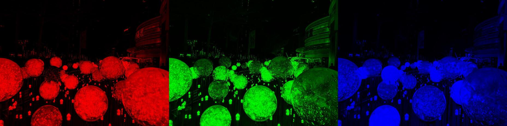
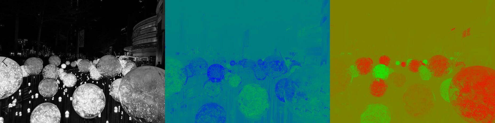

# 第一章 视频基础

## 颜色空间

计算机中存储的任意类型图像都需要遵循一定的数据描述方式，这种描述方式被称为颜色空间。颜色空间类型非常多，我以下图为例详细讲解图像的颜色空间。


### RGB颜色空间

对设计稍有了解的都会熟悉这种颜色空间，这种颜色空间是计算机屏幕显示的最直观的颜色空间。这种颜色空间的来源是因为，最初的物理科学家发现，通过红、绿、蓝光的不同强弱的组合几乎能表现出任意类型的光的颜色，所以后来计算机屏幕上每个像素点都会有这三种颜色的小灯，通过控制灯的强弱来制造出所有颜色。其中红色代表Red，绿色代表Green，蓝色代表Blue。

但这种方式有一个问题在于，一个像素点亮度从没有光到最亮，需要定义多少个颜色值呢？经过科学家反复测算，最终发现，定义256个值，可以表达16777216种颜色，能达到人类视觉的极限。所以现在的屏幕颜色及亮度均使用这种RGB24的方式来表达颜色。24代表取值24位，也就是每种颜色8位，分别取值为0-255。

下面我将RGB颜色给拆开：



由此可见，上图中红色区域在下图红色图片相同区域最亮；蓝色区域在下图蓝色图片相同区域最亮。绿色不太好对比，但可见黄色，这种颜色是通过红色和绿色组成，所以黄色区域在下图红色和绿色图片相同区域都比较亮。

### YUV颜色空间

这种颜色空间是视频格式的主要的颜色空间，与RGB一样，这种颜色空间也能表示任意颜色。这种颜色空间有非常多种标准，但无一例外均可以通过RGB颜色值的运算得到，可以把这种颜色空间与RGB的关系想象为这样：RGB为立体坐标系的xyz轴正方向向量，YUV为这个坐标系上三个不处在统一平面的三个向量，通过数学原理，YUV就能与RGB互相转换了。

这种颜色空间的标准有多种，我以[YCbCr Rec.601](https://en.wikipedia.org/wiki/YCbCr)标准来讲解。这种颜色空间的原理是，通过三种颜色分量，Y（luma，代表亮度），U（Chroma Blue，Cb，代表蓝色色度），V（Chroma Red，Cr，代表红色色度）三个分量来描述一个颜色。这种描述方式将绿色给去掉了，蓝色和红色分别表示冷色色调与暖色色调。



这张图估计很多人都会觉得，左边的图像最清晰，中间和右边图像不容易分辨。事实也是这样，人类一般对细节最敏感，但对冷色系和暖色系色调的分辨比较迟钝。

科学家于是想到了一种肉眼很难分辨出的压缩方式，也就是，原本Y，U，V分别一个值代表一个像素，现在两个Y或四个Y共用一个U和一个V。

目前最常用的压缩编码方式是四个Y共用一个U和一个V，这种编码方式相对于RGB来说节省了一半的存储空间。示例像素排列：

* RGB排列：RGBRGBRGBRGB
* YUV排列：YYYYUV

RGB转YUV公式为：

```
Y =   0.299    * R + 0.587    * G + 0.114    * B
U = - 0.168736 * R - 0.331264 * G + 0.5      * B
V =   0.5      * R - 0.418688 * G - 0.081312 * B
```

YUV转RGB公式为：

```
R = Y + 1.402 * V
G = Y - 0.344 * U - 0.714 * V
B = Y + 1.772 * U
```

## 推荐资料

如果想要对视频编码了解的更加深入，推荐学习：[digital_video_introduction](https://github.com/leandromoreira/digital_video_introduction)

[返回首页](../README.md) | [上一章 序言](./00_startup.md) | [下一章 音频基础](./02_audio_introduce.md)

## 许可

[](http://creativecommons.org/licenses/by-nc-nd/4.0/)

本教程采用[知识共享署名-非商业性使用-禁止演绎 4.0 国际许可协议](http://creativecommons.org/licenses/by-nc-nd/4.0/)许可。
