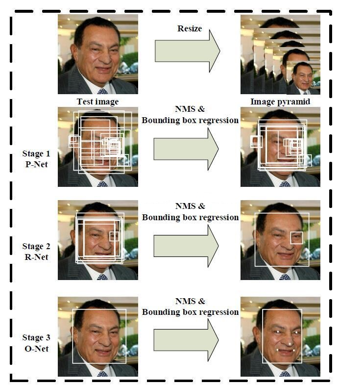

# 附录1 人脸检测

## 人脸检测原理

使用一种在计算机行业里称之为“炼丹”的技术，也就是深度学习。不论是人脸检测亦或文字识别，都会有一定的准确率，无法达到100%精确。下面我简单介绍一下人脸识别中的常用算法：MTCNN。

这是原MTCNN论文中的图，原理就是，首先通过resize，生成图片金字塔，这一步的目的是，神经网络中的人脸大小是固定的，通过这种方式能识别到不同大小的人脸。第一步处理完后，通过P网络，这个网络能得到大量的人脸候选，然后经过R网络精调，去掉部分重叠的候选图片，然后再通过O网络，得到人脸关键点坐标。

## 人脸检测实现

识别人脸的网络，网上有非常多的现成的，比如：

- [ZQCNN](https://github.com/zuoqing1988/ZQCNN)
- [libfacedetection](https://github.com/ShiqiYu/libfacedetection)
- [Ultra-Light-Fast-Generic-Face-Detector-1MB](https://github.com/Linzaer/Ultra-Light-Fast-Generic-Face-Detector-1MB)

当然除了这几个之外，还有其他的人脸识别库，每个库的模型都会有自己的偏向性，根据需求来确定。下面我们来使(bai)用(piao)，以ZQCNN为例：

在仓库中`ZQCNN\SamplesZQCNN\SampleMTCNN_Video`路径下，有一个`SampleMTCNN_Video.cpp`，简单修改就能跑起来，它能识别摄像头并同步经过神经网络来动态识别人脸位置。

## 人脸贴图

找到人脸后，可能需要做一些贴纸，比如叼个烟枪之类的，这儿有个麻烦的地方是，如何计算缩放及旋转角度等。网上有篇文章说的非常好。

地址：<https://cloud.tencent.com/developer/article/1536158>
